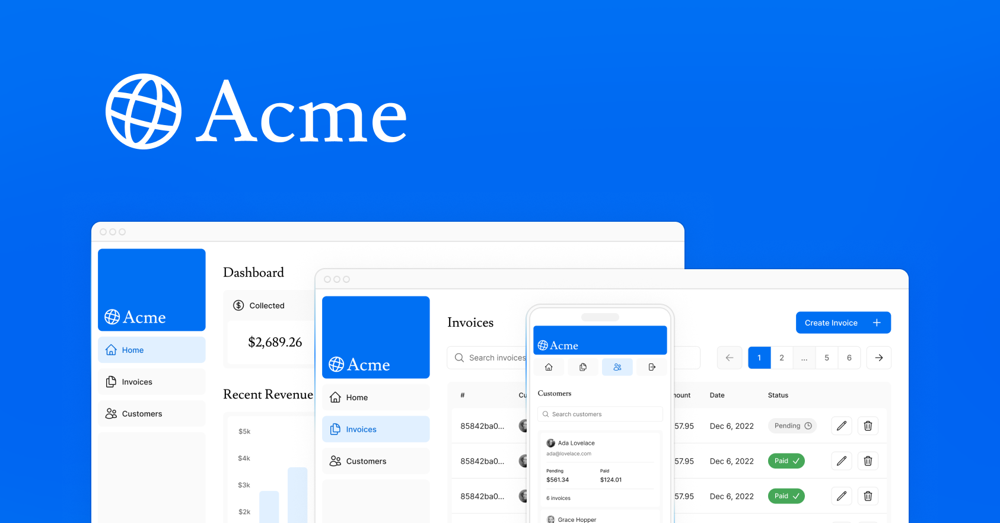

# Next.js Invoice Dashboard

A full-stack invoice management dashboard built with Next.js, TypeScript, PostgreSQL, and Tailwind CSS.

The application provides a responsive dashboard for managing customers and invoices, tracking payment statuses, viewing revenue data, and performing common invoice management tasks.



## Features

- Dashboard with revenue and invoice metrics
- Monthly revenue visualization
- Latest invoice activity
- Customer management
- Invoice search and pagination
- Create, edit, and delete invoices
- Paid and pending invoice tracking
- Customer search
- Authentication with NextAuth
- Form validation with Zod
- Server Actions
- PostgreSQL database integration
- Loading skeletons and React Suspense
- Responsive desktop and mobile layouts

## Tech Stack

- Next.js
- React
- TypeScript
- Tailwind CSS
- PostgreSQL
- NextAuth
- Zod
- Vercel

## Key Next.js Concepts

This project demonstrates several features of the Next.js App Router, including:

- Server Components
- Server Actions
- Dynamic Routes
- Route Groups
- Streaming and Suspense
- Search parameters
- Data fetching
- Cache revalidation
- Authentication
- Metadata
- Error handling

## Application

The dashboard provides an overview of collected and pending invoice totals, total invoices, total customers, recent revenue, and the latest invoice activity.

Users can browse and search invoices, create new invoices, edit existing invoices, delete invoices, and view customer information.

## Live Demo

[View Live Application](https://nextjs-dashboard-gamma-azure-68.vercel.app/)

## Running Locally

Clone the repository:

```bash
git clone https://github.com/curtisaallen/nextjs-dashboard.git
```

Install dependencies:

```bash
pnpm install
```

Start the development server:

```bash
pnpm dev
```

Then visit:

```text
http://localhost:3000
```

## Environment Variables

The application requires environment variables for the PostgreSQL database and authentication.

Create a `.env` file in the project root and configure the required values.

Do not commit your `.env` file or database credentials to source control.

## Background

This project was originally created while completing the Next.js App Router course and was extended into a complete invoice dashboard with customer management, authentication, database operations, search, validation, and responsive UI functionality.

## Author

**Curtis Allen**

Senior Front-End / Web Developer specializing in modern JavaScript, React, TypeScript, Next.js, responsive UI development, and web accessibility.